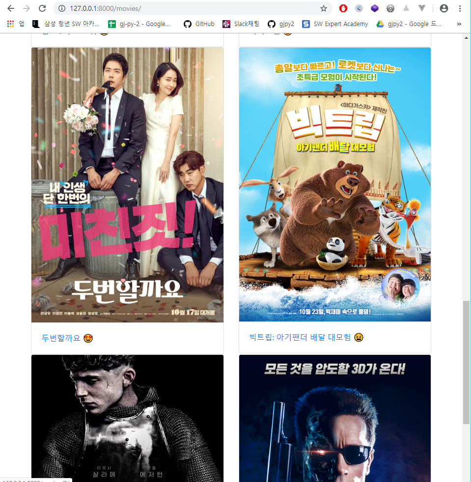
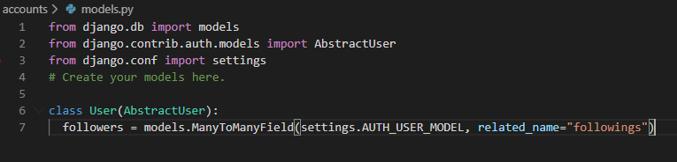
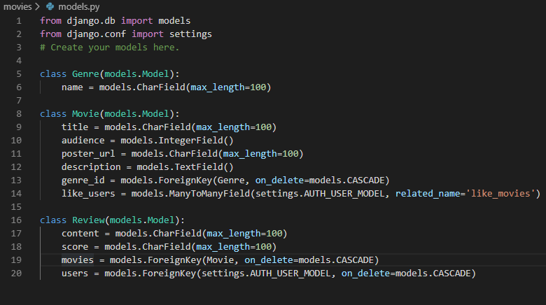
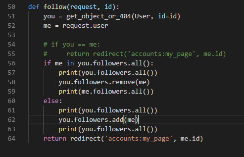
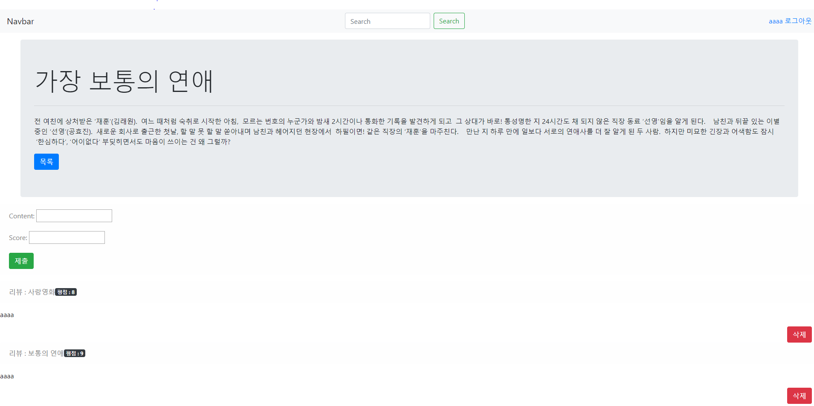
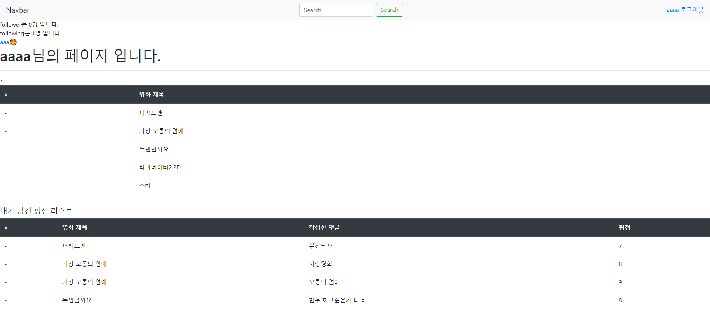

# 07_project - 데이터베이스 설계

### 01. accounts

#### | UserCreationForm을 customizig하기
``` python 
# UserCreationForm 가져오기
from django.contrib.auth.forms import UserCreationForm
# 기존에 있는 User모델을 가져온다
from django.contrib.auth.models import User

class CustomUserCreationForm(UserCreationForm):
    class Meta:
        model = User
        # 사용할 요소를 추가하기(원래요소는 3개인데 6개 요소로 늘리기 위해서)
        fields = ('username', 'first_name', 'last_name', 'email', 'password1', 'password2',)
```


#### | my_page 만들기

```python
def my_page(request, id):
    # user의 정보를 가져와서 보내준다.
    user_info = get_object_or_404(User, id=id)
    context = {
        'user_info':user_info,
    }
   return render(reqeust, 'accounts/my_page.html', context)
```

```html


  <h1>{{user_info.username}}님의 페이지 입니다.</h1>
  <h5>좋아하는 영화정보</h5>
-------- user가 좋아요를 누른 모든 영화 중에서 영화의 타이틀만 가져오기 ------
  
    <p>{{movie.title}}</p>
  
  <hr>
  <h5>내가 남긴 평점 리스트</h5>
------user가 남긴 리뷰중 영화제목과 평점을 보이게 하기
  
    {{review.movies.title}}: {{review.score}}
  

```


### 02. movies

#### | 주어진 .json 자료 이용하기

```python
# fixtures 폴더 만들어서 json파일 넣기
# 터미널에 입력하기
python manage.py loaddata genre.json
python manage.py loaddata movie.json
```


#### | model정의하기

```python
# settings이 가지고 있는 AUTH_USER_MODEL을 사용하기 위해서
from django.conf import settings

class Movie(models.Model):
    title = models.CharField(max_length=100)
    audience = models.IntegerField()
    poster_url = models.CharField(max_length=100)
    description = models.TextField()
    genre_id = models.ForeignKey(Genre, on_delete=models.CASCADE)
    # 영화에 좋아요를 누를 수 있는 사람이 여러명이기에 => ManyToManyField이용.
    like_users = models.ManyToManyField(settings.AUTH_USER_MODEL, related_name='like_movies')

class Review(models.Model):
    content = models.CharField(max_length=100)
    score = models.CharField(max_length=100)
    movies = models.ForeignKey(Movie, on_delete=models.CASCADE)
    users = models.ForeignKey(settings.AUTH_USER_MODEL, on_delete=models.CASCADE)
```


#### |review 만들기(views.py)

```python
def review_create(request, id):
    movie = get_object_or_404(Movie, id=id)
    review_form = ReviewForm(request.POST)
    if review_form.is_valid():
        # 리뷰에 movie랑 user을 연결하기 전에 임시 저장
        review = review_form.save(commit=False)
        # 리뷰에 movie랑 user연결
        review.movies = movie
        review.users = request.user
        review.save()
        return redirect('movies:detail', id)
```


##### | 주의해야되는 부분

```html

  <div class="text-right mr-3">
     ----- url에서 입력한 순서에 따라서 review.id, movie.id를 입력해야한다. 순서바뀌면 동작안함 
    <a href="" class="btn btn-danger">삭제</a>
  </div>

```


# Index Page




# 모델 설정






# User follow logic



# Detail Page



# My Page

